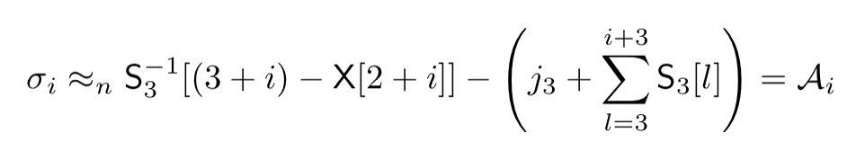

# CZ4010 Applied Cryptography Course Project: WEP Hacking
Group: P06T5\
Team members:
- Tan Wei Ren, Ezekiel
- Hui Wai Yan

## Contents
- [Introduction and Motivation](https://github.com/ezekieltan/CZ4010-submit#introduction-and-motivation)
- [Research](https://github.com/ezekieltan/CZ4010-submit#research)
- [Design and Development](https://github.com/ezekieltan/CZ4010-submit#design-and-development)
- [Difficulties Faced](https://github.com/ezekieltan/CZ4010-submit#difficulties-faced)
- [Learning Points](https://github.com/ezekieltan/CZ4010-submit#learning-points)
- [Equipment Used](https://github.com/ezekieltan/CZ4010-submit#equipment-used)
- [Directory](https://github.com/ezekieltan/CZ4010-submit#directory)
- [Use of Code](https://github.com/ezekieltan/CZ4010-submit#use-of-code)
- [References](https://github.com/ezekieltan/CZ4010-submit#references)

## Introduction and Motivation
The aim of this project is to explore the vulnerabilities of WEP WiFi and demonstrate the cracking of the WEP password. It involves research including a background study on RC4 as well as attack strategies. In this project, we capture WEP packets over a target WiFi network and analyse the packets exploiting known RC4 vulnerabilities. By implementing methods found in the research papers, we then crack the password of the target WEP WiFi router through analysis on the packets captured.

This topic was chosen for several reasons:
- To understand how cryptographic algorithms are cracked
- To be aware and able to spot future exploits
- To try out statistical analysis
- To understand the importance of random generators

## Research
Wired Equivalent Privacy (WEP) uses the stream cipher RC4, which was introduced in 1997 in the IEEE Wi-Fi standard 802.11b.

### RC4 Vulnerabilities
Since 2001, there have been publised papers of vulnerabilities in RC4 that allow WEP to be cracked. These are a few that we tried:
- FMS
- Klein
- PTW

Due to various limitations of the different methods, our final working implementation was on PTW. PTW is also the main method used by Aircrack-ng's WEP cracker.

#### PTW
The PTW method works by exploiting a relationship between the output keystream and the key byte value through statistical analysis.

This is an improvement to the Klein attack, as the equation works for every byte of the key. The previous byte of the key does not need to be figured out to crack the next byte (i.e. RK[0] is not required to crack RK[1], RK[1] is not required to crack RK[2], etc.) This eliminates the expensive statistical calculations required for every value of each byte, resulting in the ability to brute force a far greater number of keys in reasonable time. The way this is accomplished is that the iteration of the S box at the KSA stage, where i=3, is used as an approximation for i=4, 5, 6, and so on, as the S box is not going to change much for the next 4 or 12 iterations for 40 and 104 bit keys respectively.

Due to a key (pun unintended) assumption in the main equation, some keys are not vulnerable - these are called strong keys, which are not susceptible to the vulnerability. The paper includes an equation to check for strong key bytes, which we also implemented inside our code.

## Design and Development
For our implementation, we used the PTW method which is also the main algorithm used by [Aircrack-ng](https://www.aircrack-ng.org), a free software that provides the tools needed for WiFi analysis. The main flow of actions is as follows:
1. Sniff packets from target WiFi network using Airodump-ng.
2. Convert data from the .cap file to .csv and import it with pandas (Python library).
3. Run statistical analysis using PTW.
4. Brute force the likeliest key combinations returned by the algorithm to double-check for correctness. If the key has a strong key byte, run a brute force on that key byte itself.

Development was done mainly using Python with jupyter notebook for the data analysis. We also had to use some command-line commands to work with the data files before they were imported into jupyter notebook.

## Difficulties Faced

- Router IV allocation algorithm  
It was observed that our router sets iv[0] == iv[2] for ARP packets.
FMS attack does not work because it requires multiple packets with a certain iv[0] to do meaningful statistical analysis. Settings iv[0] == iv[2] guarantees at most 255 packets with a certain iv[0], which would be not enough to perform this attack well with packet injection.

- Router protection against ARP injection  
Even with the above limitation, a total of 65536 IVs are possible for ARP packets.
However, it was observed that the number of IVs given does not exceed 30000 no matter how long injection has been running for. Same IV and same root key gives the same keystream, which when used to encrypt the same ARP packet, produces the same ciphertext over and over again. Thus, injecting beyond a certain point is completely useless. To get sequential IVs, "natural" IPv4 traffic is required, which is not always available and also large and harder to process.

- High amount of computational power required for processing  
Packet processing from .cap to .csv files was very computationally intensive, in terms of CPU, RAM and space. pyshark does not discard packet from RAM after it is done with it. As a result, packet files had to be split into smaller chunks to avoid using up RAM. The process also had to be multithreaded to save time, as processing time for large .cap files could be over an hour. Even after that, .cap and .csv files could be over a gigabyte.

- Issues regarding hardware  
Not all wifi adapters can be used due to the limited availability of cracked drivers. Monitor mode and packet injection are not available on most first party drivers. Our wifi adapter only works on 2.4GHz, and we faced severe congestion and interference issues.

## Learning Points
- At the core, this is a practical exploit of the non-uniform characteristics of RC4. While such issues might seem abstract and insignificant, they can be exploited to do considerable damage in this case, considering the amount of potentially sensitive traffic going through Wi-Fi networks everyday. A cracked password not only grants the attacker access to the network, it also gives the attacker the ability to view all packets going through the network, unencrypted. 

- Efficiency of this implementation is very low due to the use of libraries like pyshark and Python, an interpretive language. Aircrack-ng, the popular password cracking tool, is written mostly in C, a compiled language, and has the advantage of being tightly integrated, meaning it has a lot less inefficiencies. This allows it to crack passwords in seconds, while also being able to brute force a greater number of keys in a reasonable amount of time.

- Cracking the WEP key is statistical in nature. This means a favourable outcome is never guaranteed. Aircrack mentions on their site that "the statistical approach can only take you so far. The idea is to get into the ball park with statistics then use brute force to finish the job." This means some odd inputs and results are to be expected during development. They have to be accounted for and also make it harder to determine the efficacy of the program. https://www.aircrack-ng.org/doku.php?id=aircrack-ng

## Equipment Used
| Hardware |	Software (packet capture) | Software (password cracker)| 
|-|-|-|
|TP-Link TL-WR840N	|VMWare Workstation 16 Player|Jupyter Notebook|
|Realtek RTL8188EU (with aircrack driver)|	CentOS 7|Python 3.9.6|
|HP Omen 15-CE0XX (i7-7700HQ, 16GB RAM)	|aircrack-ng|Windows 10 21H1|
||aircrack RTL8188eus driver|editcap (part of Wireshark)|

## Directory
|File|Purpose|
|-|-|
|capAnalysis.ipynb|Password cracker|
|capReader.py|Read a folder of .cap files (single threaded)|
|capReaderMerger.py|Merge a folder of processed CSV files|
|capReaderMulti.py|Read a folder of .cap files (multi threaded)|
|capReaderSingle.py|Worker for capReaderMulti.py|
|helper.py|RC4 functions and string converters|
|lib_FileSystemUtilities.py|To assist in file operations https://github.com/ezekieltan/GenericUtilities|
|lib_TableReader.py|To assist in CSV operations https://github.com/ezekieltan/TableReader|
|theoreticalAnalysis.py|Statistical analysis of number of IVs|
|theoreticalAnalysis2.py|Viewer for CSVs from theoreticalAnalysis.py|
|WEPcrack-05.cap|Sample .cap file from airodump|
|WEPcrack-05.csv|Sample .csv file for cracking password|

## Use of Code
| Steps |	Command | Remarks |
|-|-|-|
|From Fresh CentOS 7 VM	||
|Enter root|	su -|root is required to perform driver installation|
|Install driver according to instructions|	https://github.com/aircrack-ng/rtl8188eus ||
|Pass wifi adapter to VM	|Ensure it shows up and can scan for nearby networks before proceeding|
|Reboot|||
|Enter root|su -||
|Update all packages|	yum update||
|Make a working directory in the Desktop|mkdir wd||
|Get aircrack|wget https://li.nux.ro/download/nux/dextop/el7/x86_64/aircrack-ng-1.2-0.8rc2.el7.nux.x86_64.rpm --no-check-certificate||
|Install aircrack|	rpm -i aircrack-ng-1.2-0.8rc2.el7.nux.x86_64.rpm ||
|Test airmon|	airmon-ng||
|Stop inteferring processes	|sudo airmon-ng check kill||
|Enter monitor mode	|sudo ip link set `interface` down||
|	|sudo iw dev `interface` set type monitor||
|Launch airodump-ng|	airodump-ng `interface`||
|Start capturing|	airodump-ng --bssid `router MAC` -c `channel` -w WEPcrack -D `interface`|At least one device needs to be connected and with traffic flowing|
|Start injecting	|aireplay-ng -3 -b `router MAC` -h `station MAC` -D `interface`|At least one device needs to be connected, and need to wait for ARP request. If that device is deassociated from the network, injection will fail|
|Crack packets with aircrack (to test)	|aircrack-ng `filename`||
|Switch to Windows computer|||
|Split packets	|"C:\Program Files\Wireshark\editcap.exe" -c `packets per file` `filename` dump||
|Process packets	|python capReaderMulti.py `folder name` `packets per file`||
|Merge CSV files|	python capReaderMerger.py `folder name`||
|Crack passwords	|capAnalysis.ipynb||

## References
FMS paper: https://link.springer.com/chapter/10.1007/3-540-45537-X_1  
Klein paper: https://link.springer.com.remotexs.ntu.edu.sg/article/10.1007/s10623-008-9206-6  
PTW paper: https://eprint.iacr.org/2007/120.pdf  
aircrack driver for RTL8188EU: https://github.com/aircrack-ng/rtl8188eus  
IPv4 packet structure: https://www.tutorialspoint.com/ipv4/ipv4_packet_structure.htm  
ARP packet structure: http://www.tcpipguide.com/free/t_ARPMessageFormat.htm  
SNAP header structure: https://www.ibm.com/docs/en/zos/2.2.0?topic=internetworking-subnetwork-access-protocol-snap  
